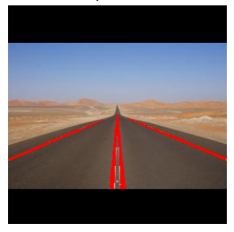
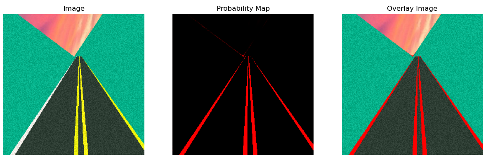
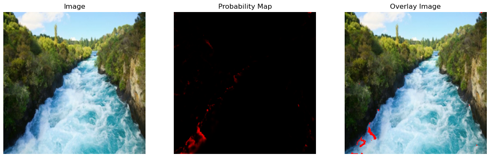
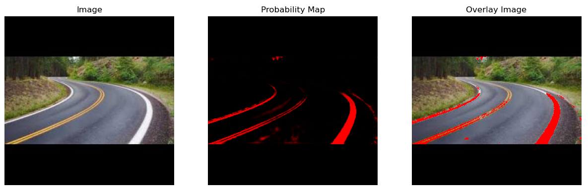

# Deep Lane Detection

<p align="center">
  
</p>


## 📌 Project Description
This project was part of my lab internship at FAU Erlangen-Nürnberg. The
highlights are noted as below:
• Neural net based road-lane detection
• A road simulator that creates artificial images of road/lanes for training network
• Used PyTorch to implement a U-Net for image segmentation
• Worked on image augmentation of the simulated dataset for training network
• Evaluated the network's performance on real-life images and videos and performed hyperparameter tuning

---

## ⚙️ Environment Setup (Conda)

We provide a Conda environment file for easy reproducibility.

### 1. Clone the repository
```bash
git clone https://github.com/Haris-Asif11/deep-lane-detection.git
```

### 2. Create the Conda Environment
```bash
conda env create -f environment.yaml
```

### 3. Activate the Environment
```bash
conda activate deep-lane-det-env

```

## 🚀 Usage
### Training
To train the model, use:
```bash
python main.py

```
The code provides an example. You first set up an experiment, create the 
dataset via the simulator and specify any augmentations, change network 
parameters and then start the training. You may also change the configuration
of the simulator using the sim_config.json

### Evaluation
To evaluate the model trained in the previous step, use:
```bash
python run_predict.py

```
Once again, you have to specify the experiment name that you made during the
training step. The evaluation script will show you the predicted lane detections
on the given test set, and save them. You can change the test set to real-world
images of roads to see how the model's performance translates from simulated
to real-life images.

## Results
Here is an example of the model's prediction on a simulated test image:



And the model applied to a real-life image that does not contain any lane:



Although the model is only trained on simulated images, it can use its knowledge to predict lanes in real-life
images as well:



